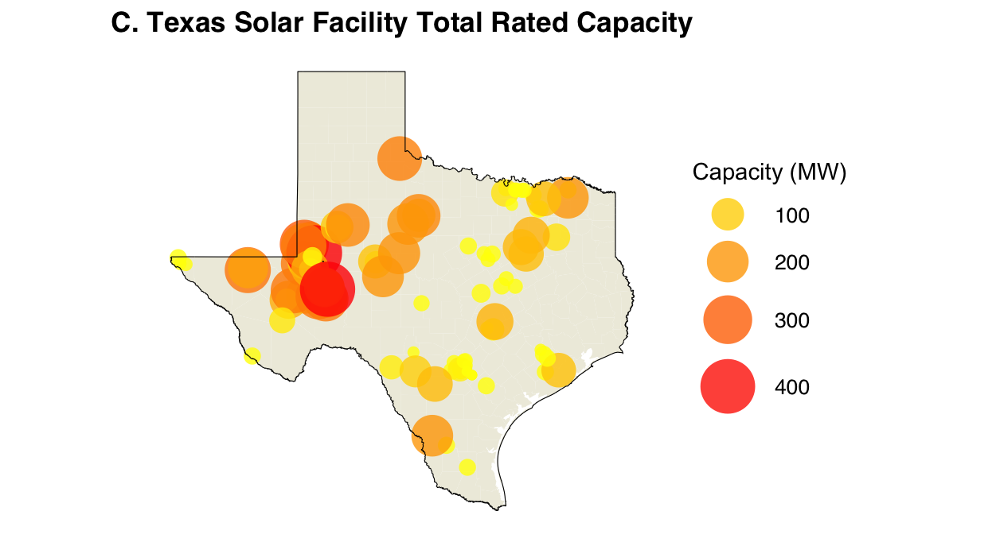

# TX-Solar
TX Solar MW Capacity &amp; PV Potential

## Description
I started this project, because I was interested in learning more about the dynamics surrounding Texas' reliance on Solar to prevent blackouts during Summer peak temperatures. Additionally, Texas is home to the 2nd largest Solar capacity (MW) after California. First, I wanted to map contigious US states according to their installed Solar capacity to get a general idea. I then wanted to focus in on Texas to learn more about where solar installations are located, while also visualizing Photovoltaic potential accross Texas Counties to see how the two maps compare.

## Data
I use solar installation data from Solar Energy Industries Assosciation (SEIA) to map the facilities and their corresponding size and location. I then utilize the Google Earth Engine (GEE) API within Python to gather PV potential Data from Global Solar Atlas, a collaborative project between SolarGIS and the World Bank. 

## Work Flow
Since this project was my attempt to try new different techniques and packages accross langages, the work flow may be non-linear. This excersie follows these steps below:

1. Use the geemap package within Python to query values for mean Global Photovoltaic Power Potential (PVOUT) and export as csv.
2. Import the csv from the step above for all Texas Counties into R to visualize the gradient of PV Power Potential
3. Download SEIA Solar Facility data and use ggplot2 to map the total rated capacity (MW) and locotion of all Texas Solar Utility-Scale facilities as geopoints layered on top of a shapefile of the state of Texas.

## 1. Global Photovoltaic Power Potential (PVOUT)

